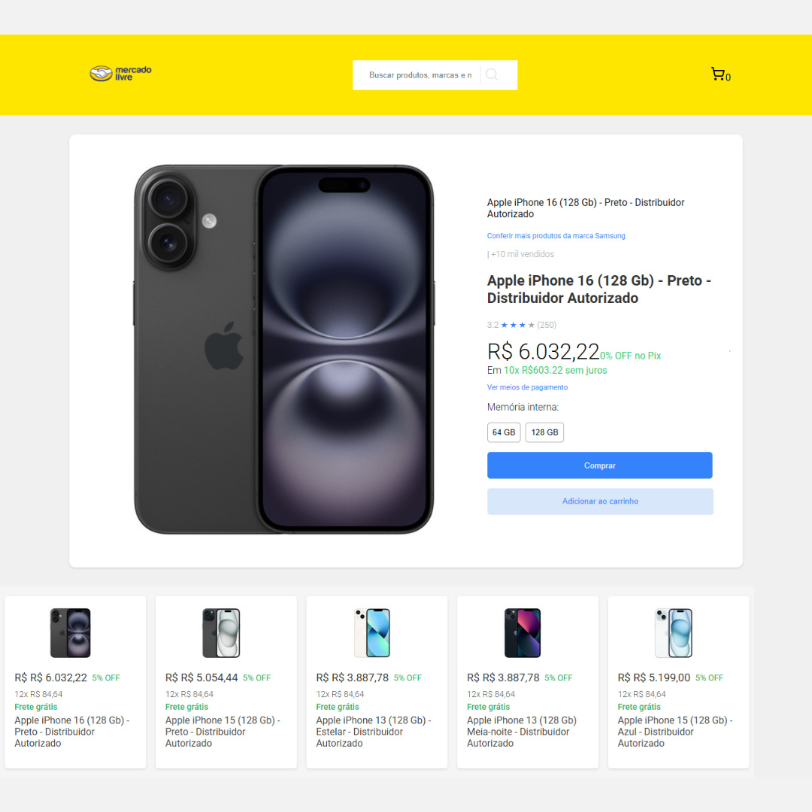

# Project title

Consume API Mercado livre

# Tools used

 
 

Vite + ReactJS + Javascript

# Description

Application created to analyze the API provided by Mercado Libre Brazil, check the API's behavior in the use and search of products using API

---

**Screen 📷**

---

## Installation

git clone https://github.com/ivanmartins090317/consume-mlb.git

after cloning the repository into yours where you copied it
cd consume-mlb

after that:
npm install

after that:
npm run dev

## Reference

[ReactJS] https://react.dev/learn

[useState] https://legacy.reactjs.org/docs/hooks-state.html

[useEffect] https://react.dev/reference/react/useEffect

[useContext] https://react.dev/reference/react/useContext

## Autores

- [Ivan Martins] https://www.linkedin.com/in/ivan-roberto-220ab310b/

## Functions

- Search for goods on Mercado livre

## Improvements

Create a cart component
Direct the user to the best product on Mercado Libre
Responsive layout

## Project structure

Simple MVC project structure,
applied some basic javascript and Desin Pattern concepts.
